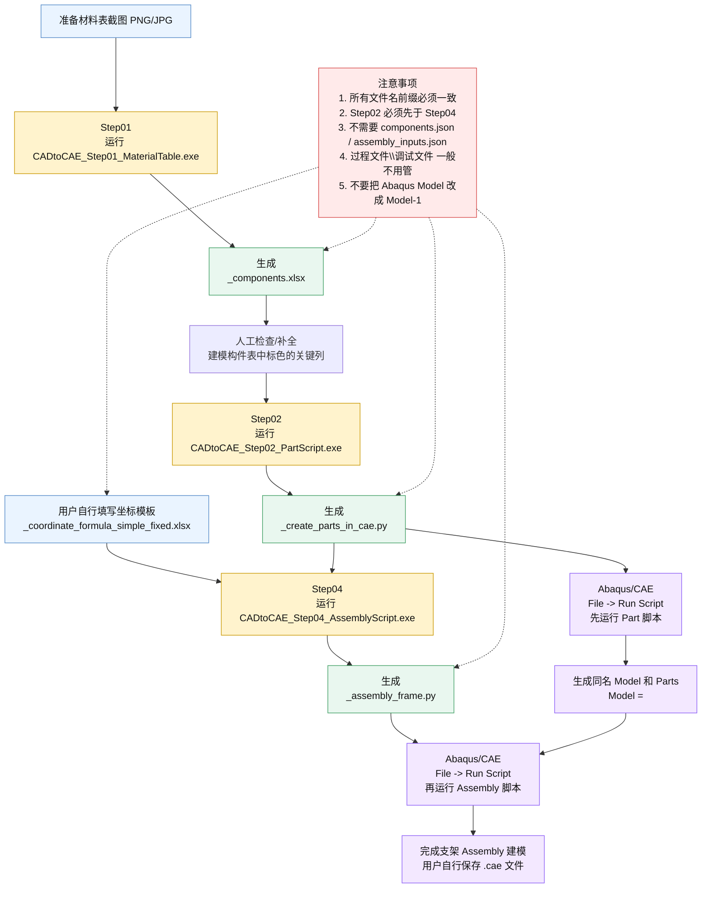

# CADtoCAE 用户操作流程图

```mermaid
flowchart TD
    A["准备材料表截图 PNG/JPG"] --> B["Step01<br/>运行 CADtoCAE_Step01_MaterialTable.exe"]
    B --> C["生成<br/><project_prefix>_components.xlsx"]

    C --> D["人工检查/补全<br/>建模构件表中标色的关键列"]
    D --> E["Step02<br/>运行 CADtoCAE_Step02_PartScript.exe"]
    E --> F["生成<br/><project_prefix>_create_parts_in_cae.py"]

    G["用户自行填写坐标模板<br/><project_prefix>_coordinate_formula_simple_fixed.xlsx"] --> H["Step04<br/>运行 CADtoCAE_Step04_AssemblyScript.exe"]
    F --> H
    H --> I["生成<br/><project_prefix>_assembly_frame.py"]

    F --> J["Abaqus/CAE<br/>File -> Run Script<br/>先运行 Part 脚本"]
    J --> K["生成同名 Model 和 Parts<br/>Model = <project_prefix>"]
    I --> L["Abaqus/CAE<br/>File -> Run Script<br/>再运行 Assembly 脚本"]
    K --> L
    L --> M["完成支架 Assembly 建模<br/>用户自行保存 .cae 文件"]

    N["注意事项<br/>1. 所有文件名前缀必须一致<br/>2. Step02 必须先于 Step04<br/>3. 不需要 components.json / assembly_inputs.json<br/>4. 过程文件\\调试文件 一般不用管<br/>5. 不要把 Abaqus Model 改成 Model-1"] -.-> C
    N -.-> F
    N -.-> G
    N -.-> I

    classDef input fill:#eaf4ff,stroke:#4f86c6,color:#111;
    classDef exe fill:#fff3cd,stroke:#c99700,color:#111;
    classDef file fill:#e9f7ef,stroke:#3c9d61,color:#111;
    classDef abaqus fill:#f3e8ff,stroke:#8b5cf6,color:#111;
    classDef note fill:#ffeaea,stroke:#d64545,color:#111;

    class A,G input;
    class B,E,H exe;
    class C,F,I file;
    class J,K,L,M abaqus;
    class N note;
```
